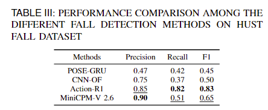
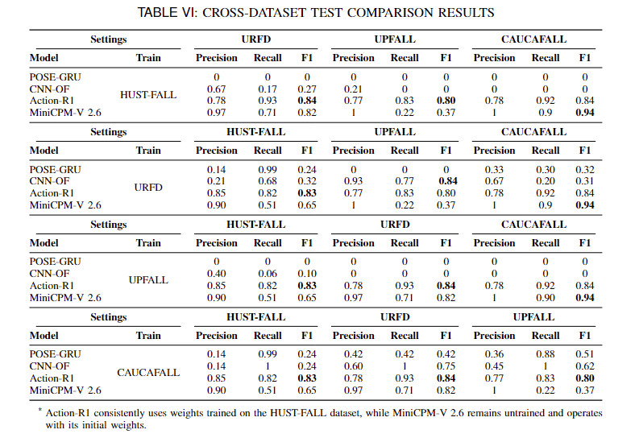

# Towards Unconstrained Fall Detection Using Vision Language Model: Dataset,Theory and Practices

## 📖 Introduction
Unconstrained fall detection is crucial for real-world applications but remains underexplored due to the lack of real-world fall data and the limited generalization of existing methods. To address these challenges, we introduce HUST-FALL, a fine-grained textual multimodal dataset for unconstrained fall detection and  further propose Action-R1, a reinforcement learning-based model that aligns visual fall cues with textual semantics. Our method demonstrates strong generalization and efficiency, significantly outperforming traditional CNN/RNN-based baselines in cross-dataset settings, and achieving performance comparable to large-scale multimodal models with only a fraction of the parameters. 

## 🔍 Contributions
- HUST-FALL is the first unconstrained fall detection dataset in the wild that incorporates fine-grained textual information.

- We are the first to introduce reinforcement learning with verifiable rewards into Human Action Recognition, and apply it to fall detection.

- Action-R1 demonstrates strong cross-dataset performance, highlighting its generalization capability.

## 🏆 Performance
- Unconstrained fall detection comparison

- Cross dataset comparison

## 🔮 Dataset Download
The dataset is provided for research purposes to a researcher only. Please do not release the data or redistribute this link to anyone else without our permission. Contact Yang_Xiao@hust.edu.cn if any question or any commercial use.

## 🌸 Ackownledgements
- Our implementation is built upon the foundation of [R1-Omni](https://github.com/HumanMLLM/R1-Omni).

- For comparative experiments with conventional deep learning methods, we utilized the publicly available  fall detection implementation from:[Fall-Detection-with-CNNs-and-Optical-Flow](https://github.com/AdrianNunez/Fall-Detection-with-CNNs-and-Optical-Flow) and [Fall Detection using Pose Estimation and GRU](https://github.com/Erik172/fall-detection-deep-learning).[MiniCPM-V 2.6](https://github.com/OpenBMB/MiniCPM-o) is also used as a representative multimodal large model for comparative evaluation.
